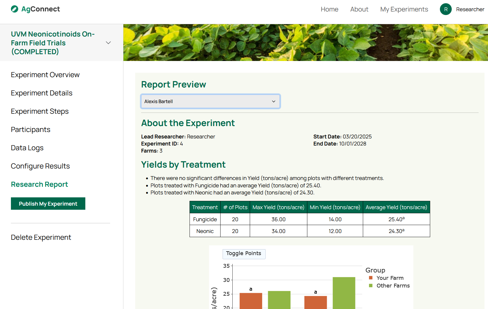

```{=html}
<div style="display: grid; grid-template-columns: 30% 70%; gap: 10px; margin: 10px;">

    

    <div style="display: flex; flex-direction: column; justify-content: center; margin-left: 20px; margin-right: 20px;">
        <p>I'm a Food Systems Data Scientist at the Food Systems Research Institute at the University of Vermont. I work on food system sustainability, on-farm research networks, and stewarding open and FAIR data.</p>
        <div class="social-icons" style="display: flex; justify-content: center; gap: 20px;">
            <a href="mailto:christopher.donovan@uvm.edu" aria-label="Email">
                <i class="fa-regular fa-envelope"></i>
            </a>
            <a href="https://www.uvm.edu/ovpr/food-systems-research/profile/chris-donovan" target="_blank">
                
            </a>
            <a href="https://www.github.com/ChrisDonovan307" target="_blank" aria-label="GitHub">
                <i class="fa-brands fa-github"></i>
            </a>
            <a href="https://gitlab.uvm.edu/Christopher.Donovan" target="_blank" aria-label="GitLab">
                <i class="fa-brands fa-gitlab"></i>
            </a>
        </div>
    </div>
</div>
```


## Projects {#projects}

### Sustainability Metrics

::: {.link-block href="https://www.github.com/Food-Systems-Research-Institute/SMdata/"}
```{=html}

<p><b>SMdata</b> is a repository that contains data collection and cleaning for the FSRI Sustainability Metrics project. Most of the wrangling is in R, but geospatial processing is handled in Python. It is also available as an R package, which makes it easy to get access to datasets as well as convenience functions for working with the metrics.</p>
```
:::

::: {.link-block href="https://fsrc.w3.uvm.edu/sustainability_metrics/pages/index.html"}
```{=html}
<p><b>SMdocs</b> is a website that contains figures and analyses for the Sustainability Metrics project. It includes a description of the indicator selection processes, various figures describing the indicator framework, as well as analyses at the national and regional levels. It is made with Quarto.</p>

```
:::

::: {.link-block href="https://fsrc.w3.uvm.edu/SMexplorer/"}
```{=html}

<p><b>SMexplorer</b> is a Shiny app that explores food system sustainability data in the Northeast. It includes an interactive map, a metric comparison page, a county details dashboard, as well as a metadata table. It uses the Golem production-grade Shiny applications.</p>
```
:::


### AgConnect

::: {.link-block href="https://www.uvm.edu/extension/farm/online-tool-agconnect"}
```{=html}
<p><b>AgConnect</b> (work in progress) is UVM Extension platform that will facilitate on-farm research trials by connecting farmers with researchers, help manage experiments, and provide automated analyses and reports. The platform is being developed with Ruby on Rails and is expected to launch in the spring of 2026.</p>

```
:::


### Repeated Environmental Behavior Latent Scale

::: {.link-block href="https://chrisdonovan307.github.io/rebl/index.html"}
```{=html}

<p>The <b>REBL package</b> provides easy access to functions used to analyze administrations of the Repeated Environmental Behavior Latent (REBL) Scale, including cleaning surveys, recoding items, validating the model, and test linking to a baseline set of participants.</p>
```
:::

::: {.link-block href="https://cdonov12.w3.uvm.edu/reblcalc/"}
```{=html}
<p>The <b>REBL Calculator</b> is a Shiny application that makes it easy to analyze a survey administration of the REBL Scale. Upload a csv and add some parameters and it will give return model validation outputs, graphs, and new tables with REBL scores to download. The app uses the Rhino framework for full-featured Shiny production.</p>

```
:::


### Grade Calculator

::: {.link-block href="https://www.github.com/ChrisDonovan307/grade_analysis_app"}
```{=html}

<p>The <b>Grade Calculator</b> is a Shiny app to make life easier for TAs, specifically in CDAE 1020: World Food, Population, and Development. It takes a csv of grades and returns interactive graphs, summary statistics, and statistical tests to compare grades across cohorts.</p>
```
:::


### Projector

::: {.link-block href="https://www.github.com/ChrisDonovan307/projecter"}
```{=html}
<p>The <b>Projector package</b> is a collection of functions for setting up an R project for data analysis. It includes some project setup tools for file structures and the ".Rprofile" script as well as convenience functions for data wrangling.</p>
```
:::

